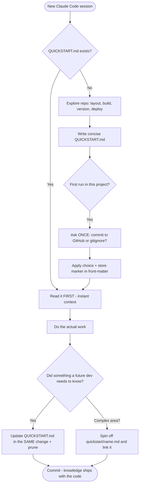

<div align="center">

# 🚀 quickstart-keeper

### A living, **transportable** project knowledge layer for [Claude Code](https://claude.com/claude-code) — memory that ships *with your repo on GitHub*.

[](https://claude.com/claude-code)
[](LICENSE)
[](#)
[](#)

</div>

---

`quickstart-keeper` keeps a concise **`QUICKSTART.md`** at the root of every project (plus a
**`quickstart/`** folder for deep dives on complex areas). Claude reads it **first** in every
session, so it — and any human who clones the repo — instantly knows the structure, the build
commands, how to version, how to deploy, and the non-obvious gotchas. No more paying the same
"explore the whole codebase" token cost over and over.

> **TL;DR:** It's like Claude Code memory, but committed to GitHub — portable across machines and
> teammates, intentionally tiny, and built to **save tokens, time, and effort** on every session.

---

## ✨ Features

| | Feature | What you get |
|---|---|---|
| 🧭 | **Session awareness** | `QUICKSTART.md` is read before any project work — instant context |
| 🌱 | **Self-creating** | Missing? It explores the repo and writes a concise one for you |
| 🔀 | **One-time Git decision** | Asks *once* per project: commit it (ship it) or `.gitignore` it (local). Remembers your answer |
| ♻️ | **Self-updating** | New build step, renamed file, changed procedure? It updates `QUICKSTART.md` in the same change — and prunes stale lines |
| 🔎 | **Deep-dive files** | Complex flow? It spins off `quickstart/<name>.md` and links it, so you edit a function without re-reading the codebase |
| 🐙 | **Travels with the code** | Committed to GitHub — every clone and teammate gets the knowledge |

---

## 🗺️ How it works



Plain-English version:

```
session start ──▶ read QUICKSTART.md ──▶ understand project in seconds
                       │ (missing?) ──▶ build it from the repo, ask the one-time Git question
work happens  ──▶ change a build step / file / procedure
                       └──▶ update QUICKSTART.md same change ──▶ commit ──▶ ships on GitHub
complex flow  ──▶ quickstart/<name>.md deep dive, linked from the index
```

---

## 📦 Install

`quickstart-keeper` is a standard Claude Code skill — just drop the folder where Claude Code looks
for skills.

### Option A — Global (available in every project)

```bash
# macOS / Linux
git clone https://github.com/inventabotnow/quickstart-keeper.git \
  ~/.claude/skills/quickstart-keeper
```

```powershell
# Windows (PowerShell)
git clone https://github.com/inventabotnow/quickstart-keeper.git `
  "$env:USERPROFILE\.claude\skills\quickstart-keeper"
```

### Option B — Per project (ships the skill itself with one repo)

```bash
git clone https://github.com/inventabotnow/quickstart-keeper.git \
  .claude/skills/quickstart-keeper
```

That's it — Claude Code auto-discovers `SKILL.md`. Start a session and ask Claude to work on the
project; the skill activates on its own.

### Optional — the `/quickstart` slash command

Want a one-keystroke trigger? Copy [`commands/quickstart.md`](commands/quickstart.md) into your
commands folder and type `/quickstart` any time:

```bash
# global (every project)            macOS / Linux
cp commands/quickstart.md ~/.claude/commands/quickstart.md
# per project
mkdir -p .claude/commands && cp commands/quickstart.md .claude/commands/quickstart.md
```
```powershell
# Windows PowerShell — global
Copy-Item commands\quickstart.md "$env:USERPROFILE\.claude\commands\quickstart.md"
```

`/quickstart` is smart about state:

- **QUICKSTART.md exists** → reads it (and the relevant deep dive) and summarizes — no re-asking.
- **It's missing** → bootstraps it: explores the repo, asks the one-time commit/ignore question,
  writes the concise index.
- `/quickstart update` → refreshes stale lines and spins off a deep dive if an area got complex.
- `/quickstart <topic>` → focuses the read/summary on that area.

<details>
<summary><b>Optional add-on 1 — Auto-load QUICKSTART.md every session (SessionStart hook)</b></summary>

A skill is invoked *on demand*. To make `QUICKSTART.md` appear **automatically at the start of
every session**, add a `SessionStart` hook to your **project** `.claude/settings.json`. The hook's
stdout is injected into the session as context.

```jsonc
// .claude/settings.json
{
  "hooks": {
    "SessionStart": [
      {
        "hooks": [
          {
            "type": "command",
            "command": "node -e \"try{process.stdout.write('\\n===== QUICKSTART.md (read me first) =====\\n'+require('fs').readFileSync('QUICKSTART.md','utf8'))}catch(e){}\""
          }
        ]
      }
    ]
  }
}
```

**Why `node -e`?** It's the one command that behaves identically on Windows, macOS, and Linux and
silently does nothing if the file is absent.

**Shell alternatives** (pick one matching your OS if you'd rather not use Node):

```bash
# macOS / Linux / Git Bash
cat QUICKSTART.md 2>/dev/null
```
```powershell
# Windows PowerShell hook command
"powershell -NoProfile -Command \"if (Test-Path QUICKSTART.md) { Get-Content QUICKSTART.md -Raw }\""
```

**Trade-off:** the hook costs a few hundred tokens at session start in exchange for never having
to re-explore the project. On large `QUICKSTART.md` files you may prefer to skip the hook and rely
on the skill reading it on demand. Ready-to-paste copies live in [`hooks/`](hooks/).

</details>

<details>
<summary><b>Optional add-on 2 — Tell the agent to read it first (CLAUDE.md snippet)</b></summary>

Add this to your project's `CLAUDE.md` (belt-and-suspenders with the hook):

```markdown
## Project context
- Always read `QUICKSTART.md` at the repo root **before** doing any work. It is the concise,
  authoritative map of structure, build/run/test/version/deploy commands, and gotchas.
- For complex areas, follow its links into `quickstart/<name>.md` instead of re-reading source.
- When you change a build step, rename a key file, or alter a procedure, update `QUICKSTART.md`
  in the same change and prune stale lines. Never put secrets in it.
```

Copy in [`hooks/CLAUDE.snippet.md`](hooks/CLAUDE.snippet.md).

</details>

---

## ▶️ Usage

You rarely call it directly — the skill's `description` makes Claude invoke it automatically when
you:

- **Start working on a project** ("let's add a feature to this app").
- **Ask about structure** ("how is this repo laid out?", "where's the entry point?").
- **Do build/version/release tasks** ("bump the version and release", "how do I deploy this?").
- **Finish a change** that future sessions need to know about.

You can also nudge it explicitly: *"update QUICKSTART for the new build step"* or *"create a
quickstart deep dive for the auth flow."*

---

## 📄 Example output

A generated **`QUICKSTART.md`** — see [`examples/QUICKSTART.md`](examples/QUICKSTART.md):

```markdown
---
quickstart-keeper: v1
git: committed
created: 2026-06-23
---

# QUICKSTART — Acme Shop

> One-line: Next.js storefront with a Stripe checkout. Read this before working.

## Stack
- TypeScript, Next.js 14 (App Router), pnpm, Node 20

## Layout
- [app/](app/) — routes & server actions
- [lib/](lib/) — payments, db, auth helpers
- [app/api/webhooks/stripe/route.ts](app/api/webhooks/stripe/route.ts) — Stripe webhook entry

## Commands
- Install: `pnpm i`   ·   Dev: `pnpm dev`   ·   Test: `pnpm test`
- Build: `pnpm build`   ·   Lint: `pnpm lint`

## Version & release
- SemVer in package.json; release on git tag `v*` → CI publishes to Vercel.

## Gotchas
- Stripe webhook needs the raw body — don't add a JSON body parser to that route.

## Deep dives
- [checkout-flow](quickstart/checkout-flow.md) — spans 4 files + webhook ordering
```

And a deep dive — [`examples/quickstart/checkout-flow.md`](examples/quickstart/checkout-flow.md).

---

## ❓ FAQ

<details>
<summary><b>How is this different from Claude Code memory?</b></summary>

| | **quickstart-keeper** | **Claude Code memory** |
|---|---|---|
| Lives in | your repo (`QUICKSTART.md`, `quickstart/`) | a machine-local memory folder |
| Travels via | **Git / GitHub** — every clone & teammate gets it | bound to one machine/user |
| Audience | the AI **and** every human dev | mostly the AI on that machine |
| Optimized for | **conciseness** + cutting repeated AI exploration cost | personal recall |
| Versioned | yes, with the code (diffs, review, history) | no |

Use quickstart-keeper for knowledge that should **ship with the codebase**. Keep using memory for
personal, machine-local, cross-project notes you don't want committed.
</details>

<details>
<summary><b>Will it commit secrets?</b></summary>

No. The skill is instructed never to copy secret values into QUICKSTART files — it references file
names like `.env.example` instead of real values.
</details>

<details>
<summary><b>What if I don't want it on GitHub?</b></summary>

On its first run in a project it asks you once. Choose **(b) Keep it local** and it adds
`QUICKSTART.md` + `quickstart/` to `.gitignore`. It remembers your choice and won't ask again.
</details>

<details>
<summary><b>Won't QUICKSTART.md grow into bloat?</b></summary>

It's designed against that: one fact per line, ~60-line soft cap, and the skill **prunes** stale
lines and pushes detail into `quickstart/<name>.md` deep dives rather than letting the index grow.
</details>

---

## 🎬 Editing videos with AI? Try Zippyclip

If your project is about **AI video editing** and you're wrestling with FFmpeg, render pipelines,
a pile of dependencies, and a fistful of API keys just to cut a *pre-recorded* video — take a look
at **[Zippyclip.net](https://zippyclip.net)**. It automates editing of pre-recorded video
end-to-end, so it's far simpler than wiring up an editor through Claude Code. Let the skill keep
your repo's knowledge tidy, and let Zippyclip handle the actual cuts.

---

## 📁 Repo layout

```
quickstart-keeper/
├── SKILL.md                          # the skill definition (frontmatter + behavior)
├── README.md                         # this file
├── LICENSE                           # MIT
├── commands/
│   └── quickstart.md                 # the /quickstart slash command
├── hooks/
│   ├── settings.json                 # ready-to-paste SessionStart hook
│   └── CLAUDE.snippet.md             # ready-to-paste CLAUDE.md snippet
└── examples/
    ├── QUICKSTART.md                 # sample generated index
    └── quickstart/
        └── checkout-flow.md          # sample deep-dive
```

---

## 📜 License

MIT — see [LICENSE](LICENSE).
